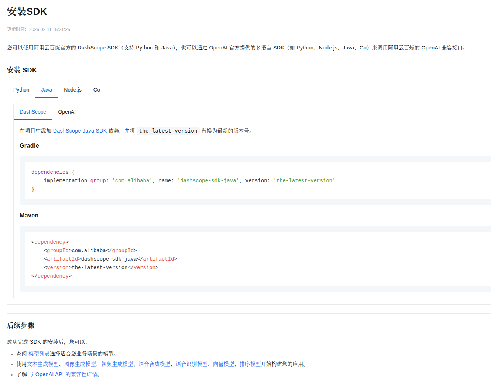

##  一、接入大模型


### 1. **选择大模型平台**：根据需求选择合适的平台，如OpenAI、百度文心一言、阿里通义千问等。

> [阿里云百炼](https://bailian.console.aliyun.com/cn-beijing)

#### （1）在阿里云百炼平台上创建应用

-  **智能体应用   工作流应用    智能体编排应用（节点为已创建的智能体应用）**
-  进入[阿里云百炼](https://bailian.console.aliyun.com/cn-beijing)平台，点击左侧导航栏的"应用管理"，然后点击"创建应用"。

-  填写应用名称、描述等信息，选择大模型类型（如Qwen），然后点击"创建"。

-  创建成功后，点击应用名称进入应用详情页面，在页面中找到"APIKey"，点击"显示"即可获取API Key。

#### （2）获取API Key。

###  2.IDE

- **cursor  kiro  vscode**

###  3.**程序接入**（四种方式）

#### 3.1 SDK接入

> [SDK官方文档](https://help.aliyun.com/zh/model-studio/install-sdk#351a991edb6nm)

 

- 1.在pom.xml文件中添加依赖,通过官方文档

- 2.[Maven中央仓库版本信息](https://mvnrepository.com/artifact/com.alibaba/dashscope-sdk-java)，在这个链接中查看最新版本号

- 3.获取API Key。

- 4.通过官方文档[dashscope](https://help.aliyun.com/zh/model-studio/qwen-api-via-dashscope?spm=a2c4g.11186623.0.0.26cc757eVt3VAP#ab9194e9a55dk)获取调用代码

- 5.（选作）创建一个接口类来存储密钥信息
  public interface TestApiKey {

    String API_KEY = "你的 API Key";
  }


### 3.2  HTTP 接入

- 1.通过官方文档[dashscope](https://help.aliyun.com/zh/model-studio/qwen-api-via-dashscope?spm=a2c4g.11186623.0.0.26cc757eVt3VAP#ab9194e9a55dk)获取调用代码
- 2.使用ai生成代码

>  将上述请求转换为 hutool 工具类的请求代码


### 3.3  SpringAI接入

- [SpringAI alibaba](https://java2ai.com/docs/quick-start)

- 代码

  ```java
  package com.example.ai_agent.demo.invoke;
  
  import jakarta.annotation.Resource;
  import org.springframework.ai.chat.messages.AssistantMessage;
  import org.springframework.ai.chat.model.ChatModel;
  import org.springframework.ai.chat.prompt.Prompt;
  import org.springframework.boot.CommandLineRunner;
  import org.springframework.stereotype.Component;
  
  @Component  // 注释掉，不让它自动运行
  public class SpringAI  implements CommandLineRunner {
      @Resource
      private ChatModel  dashscopeChatModel;
  
  
      @Override
      public void run(String... args) throws Exception {
          AssistantMessage assistantMessage = dashscopeChatModel.call(new Prompt("你好"))
                 .getResult()
                 .getOutput();
         System.out.println(assistantMessage.getText());
  
     }
  }
  
  ```

  

### 3.4 LangChain4j接入

- 1.[加入依赖](https://docs.langchain4j.dev/integrations/language-models/dashscope/)
- 2.代码