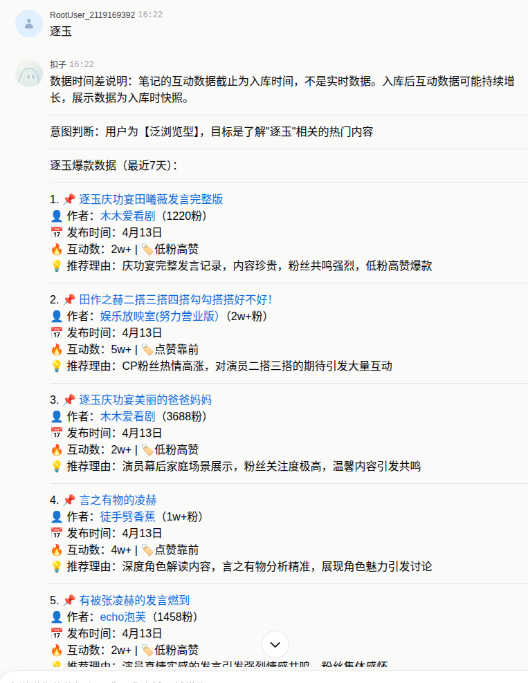

看到了你发的截图，除了Coze（扣子），国内还有非常多类似的AI智能体平台。为了帮你更好地选择，这里基于几个主流维度，整理了一份更详细的平台清单。

### 🎯 主流AI智能体平台速览

#### 🎈 字节跳动系

| 平台名称 | 官网地址 |
| :--- | :--- |
| **Coze (扣子)** | [https://www.coze.cn](https://www.coze.cn) |

*   **一句话简介**：字节跳动出品的零代码智能体搭建神器，上手快，生态强。
*   **主要特点**：主打**零代码**、**可视化拖拽**操作，提供了极其丰富的**插件和模板**（如新闻阅读、PDF处理等），支持一键发布到微信、抖音、飞书等多平台。非常适合个人开发者和中小企业快速验证想法、开发应用。

#### 🎈 百度系

| 平台名称 | 官网地址 |
| :--- | :--- |
| **文心智能体** | [https://agents.baidu.com](https://agents.baidu.com) |

*   **一句话简介**：百度推出的智能体平台，背靠文心大模型，中文理解能力强。
*   **主要特点**：既可以通过自然语言对话**零代码创建**，也支持**低代码拖拽开发**。核心优势是与百度搜索、百度地图等产品生态打通，流量分发潜力大，适合想借助百度生态获得曝光的开发者。

#### 🎈 阿里系

| 平台名称 | 官网地址 |
| :--- | :--- |
| **通义千问Agent** | [https://tongyi.aliyun.com](https://tongyi.aliyun.com) |
| **阿里云百炼** | [https://bailian.console.aliyun.com](https://bailian.console.aliyun.com) |

*   **一句话简介**：基于通义大模型的智能体平台，服务个人和企业用户。
*   **主要特点**：通义千问Agent是直接面向个人用户的应用平台；阿里云百炼则是一个更专业的开发平台，支持超过200种模型，可5-10分钟**低代码**搭建应用，提供灵活的部署方式（API、SDK、私有化等），更适合企业和开发者。

#### 🎈 腾讯系

| 平台名称 | 官网地址 |
| :--- | :--- |
| **腾讯元器** | [https://yuanqi.tencent.com](https://yuanqi.tencent.com) |

*   **一句话简介**：腾讯的智能体平台，最大优势是与微信生态无缝集成。
*   **主要特点**：支持低代码开发，其RAG（检索增强生成）能力突出，能很好地处理企业知识库。可以一键将智能体发布到微信公众号、小程序等，是打造私域流量AI助手的首选。

#### 🎈 其他大厂与AI独角兽

| 平台名称 | 官网地址 |
| :--- | :--- |
| **讯飞星辰Agent** | [https://xinghuo.xfyun.cn](https://xinghuo.xfyun.cn) |
| **智谱清言** | [https://chatglm.cn](https://chatglm.cn) |
| **天工SkyAgents** | [https://www.singularity-ai.com](https://www.singularity-ai.com) |
| **昆仑万维天工** | [https://www.singularity-ai.com](https://www.singularity-ai.com)（同上） |
| **Kimi+** | [https://kimi.moonshot.cn](https://kimi.moonshot.cn) |
| **支付宝百宝箱** | [https://agent.alipay.com](https://agent.alipay.com) |

*   **一句话简介**：各具特色的大模型厂商，覆盖了生活、工作、学习等多种场景。
*   **主要特点**：
    *   **讯飞星辰Agent**：基于星火大模型，多模态能力强（语音、图像等），提供智能编程助手，适合多行业场景。
    *   **智谱清言**：支持通过自然语言对话式创建，全模态交互（图文视频等），适合个人用户快速定制助手。
    *   **天工SkyAgents**：支持低代码快速开发部署，能直接生成PPT、表格、网页等，适合快速办公应用开发。
    *   **Kimi+**：以超长上下文和文件处理能力见长，适合处理长文档和复杂分析任务。
    *   **支付宝百宝箱**：与支付宝小程序深度集成，适合有金融或支付场景需求的开发者。

#### 🎈 开源与可私有化部署平台

| 平台名称 | 官网地址 |
| :--- | :--- |
| **Dify** | [https://dify.ai](https://dify.ai) |
| **n8n** | [https://n8n.io](https://n8n.io) |
| **智谱清言** | [https://chatglm.cn](https://chatglm.cn)（见上） |

*   **一句话简介**：代码可控、数据安全、高度灵活的技术型平台。
*   **主要特点**：
    *   **Dify**：开源的LLM应用开发平台，具备强大的RAG能力和可视化工作流，支持多模型接入。开发者可以将其**私有化部署**，保障数据安全，适合技术团队。
    *   **n8n**：开源的自动化工作流工具，可以将各种SaaS、数据库、API连接起来，并在流程中嵌入LLM节点，非常适合构建复杂的自动化业务。

#### 🎈 垂直领域与企业级方案

*   **得助智能**（官网：`https://www.51ima.com/agentflow.html`）：企业级平台，内置200+AI能力组件和100+开箱即用的行业智能体，提供完整的业务赋能工具链。
*   **实在智能**：主打企业级RPA与AI结合，可模拟人进行跨系统任务执行，适合企业流程自动化。
*   **灵燕智能体**：专注金融、医疗等垂直领域，RAG知识库解析能力强。
*   **联通元景万悟**：中国联通推出的开源智能体平台，支持企业级0代码开发。

---

总而言之，平台选择的关键在于明确你的核心需求：个人快速体验生态首推**Coze**；深耕中文生态并寻求流量首选**文心**；企业级开发看重灵活性首选**阿里云百炼**；挖掘微信生态流量首选**腾讯元器**；技术团队追求可控性首选**Dify**；复杂自动化场景首选**n8n**。

希望这份清单能帮你找到心仪的平台。如果你想深入了解其中某个平台的具体用法，随时都可以再问我～